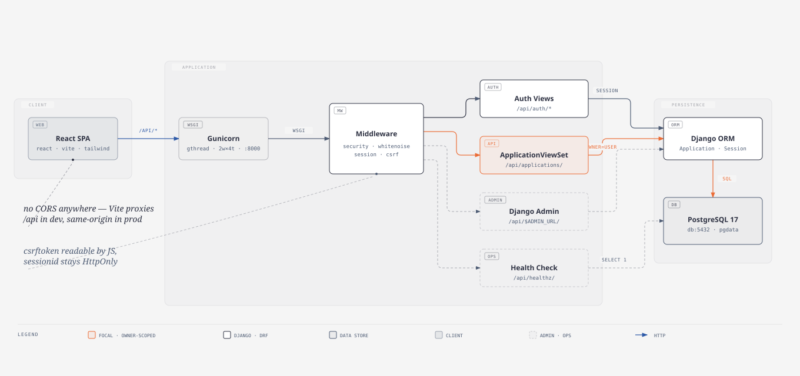

# Job Application Tracker

A multi-user REST API for tracking job applications — company, role, application link, current stage, and date applied. Each user sees only their own applications. Built with Django and Django REST Framework.

## Architecture



## Tech stack

- Python 3.12+, [uv](https://docs.astral.sh/uv/) for dependency management
- Django 6.0
- Django REST Framework
- React 19 + Vite + TypeScript + Tailwind (frontend)
- SQLite by default; engine is configurable via `DATABASE_URL` (Postgres 17 in `docker-compose.yml`)
- Docker / docker-compose (local containerized stack)
- Terraform (AWS deployment — see Infrastructure)

## Data model

`applications/models.py`

```python
class ApplicationState(models.TextChoices):
    APPLIED = "APPLIED", "Applied"
    INTERVIEWING = "INTERVIEWING", "Interviewing"
    OFFERED = "OFFER", "Offer"
    REJECTED = "REJECTED", "Rejected"

class Application(models.Model):
    title = models.CharField(max_length=128)
    company = models.CharField(max_length=128)
    date_applied = models.DateField()
    state = models.CharField(max_length=128, choices=ApplicationState.choices)
    link = models.URLField(blank=True)
    owner = models.ForeignKey(settings.AUTH_USER_MODEL, on_delete=models.CASCADE, related_name="applications")
```

`owner` is not client-settable — it's excluded from `ApplicationSerializer.fields` and set server-side in `ApplicationViewSet.perform_create()`.

## API

All endpoints are mounted under `/api/`. All application endpoints require an authenticated session.

| Method | Endpoint | Description |
|---|---|---|
| `GET` | `/api/applications/` | List the current user's applications. Supports `?state=APPLIED\|INTERVIEWING\|OFFER\|REJECTED` to filter. |
| `POST` | `/api/applications/` | Create a new application. `state` is always forced to `APPLIED` server-side (see Business rules). |
| `GET` | `/api/applications/<id>/` | Retrieve a single application. |
| `PUT` / `PATCH` | `/api/applications/<id>/` | Update an application (e.g. move to a new state). |
| `DELETE` | `/api/applications/<id>/` | Delete an application. |

Auth:

| Method | Endpoint | Description |
|---|---|---|
| `POST` | `/api/auth/login/` | Start a session. |
| `POST` | `/api/auth/logout/` | End a session. |
| `GET` | `/api/auth/session/` | Check current session status. |

Other:

| Method | Endpoint | Description |
|---|---|---|
| `GET` | `/api/healthz/` | DB connectivity check (`SELECT 1`) — unauthenticated, returns 200/503. |

The browsable API (visit any endpoint in a browser) provides an HTML form for manual testing without a frontend.

Django admin is also available at `/api/admin/` for direct data inspection (requires `manage.py createsuperuser`). The path segment is configurable via `DJANGO_ADMIN_URL` to obscure it in production.

## Business rules

- **New applications always start at `APPLIED`.** The client can't set an initial state — enforced in `ApplicationSerializer.create()`, which overwrites whatever `state` value is submitted on creation.
- **Free state transitions.** Any state can move to any other state via `PATCH`/`PUT`, allowing the user to correct mistakes (e.g. an accidental `Rejected`).
- **Filtering by state** is handled in `ApplicationViewSet.get_queryset()`, reading the `state` query parameter and narrowing the queryset when present.
- **Per-user isolation.** All endpoints require authentication, and `get_queryset()` always filters to `owner=self.request.user` — users only ever see their own applications.

## Setup

Copy `.env.example` to `.env` first — `DJANGO_SECRET_KEY` has no default and is required, and `DJANGO_ALLOWED_HOSTS` must include whatever host you're serving from.

```bash
uv sync
uv run manage.py migrate
uv run manage.py createsuperuser   # optional, for /api/admin/
uv run manage.py runserver
```

Then visit `http://127.0.0.1:8000/api/applications/`.

Alternatively, run the full stack (Postgres + migrate + web) with Docker Compose:

```bash
docker compose up
```

## Tests

```bash
uv run manage.py test applications
```

Covers the state-default-on-create rule and state filtering (both with a matching and non-matching case).

## Infrastructure

Provisioned with Terraform (`terraform/`) on AWS:

- **Frontend**: static React/Vite build (`frontend/dist`) uploaded to a private S3 bucket, served through CloudFront via Origin Access Control (no direct public S3 access).
- **Backend**: Django app built into a Docker image, pushed to ECR, run on an EC2 instance (`gunicorn`, port 8000, Amazon Linux 2023).
- **Single CloudFront distribution** fronts both: `/api/*` routes to the EC2 origin with caching disabled (covers `/api/admin/`, `/api/applications/`, `/api/auth/`, `/api/healthz/`), everything else falls through to the default S3 origin. There's also an `/admin/*` behavior routed to EC2 that's currently dead code — Django's admin only lives under `/api/admin/`, already covered by the `/api/*` behavior, and nothing is mounted at bare `/admin/`.
- **IAM**: the EC2 instance role uses AWS's managed `AmazonEC2ContainerRegistryReadOnly` policy (read access to all ECR repos in the account, not just this one) plus an inline policy scoping `ssm:GetParameter` to the `/backend/*` parameter path. `kms:Decrypt` on that same role is unscoped (`Resource: "*"`), needed because SSM `SecureString` values are decrypted through the account's default AWS-managed KMS key.
- **Network exposure**: port 8000 is open to `0.0.0.0/0`, so the backend is reachable directly by IP, bypassing CloudFront entirely — not just through the CDN as the routing above might suggest. SSH (22) is restricted to a single allow-listed IP.
- **Geo-restriction**: CloudFront only serves the US, CA, GB, and DE.
- **No custom domain**: served on the default `*.cloudfront.net` hostname with CloudFront's default certificate — no Route 53 or ACM cert configured yet.
- **Secrets**: `DJANGO_SECRET_KEY` lives in SSM Parameter Store (`SecureString`), fetched by the instance at boot via `user_data` — never stored in Terraform state or the image.
- **Database**: currently SQLite inside the container (ephemeral, resets on redeploy) — RDS Postgres migration is planned; the app already depends on `psycopg` and reads `DATABASE_URL`, so no code change is needed to switch.

## Future improvements

- **Stale-application reminders**: notify when an application has sat in `APPLIED` for 2+ weeks with no update. Needs a `last_updated` timestamp field on the model, plus a scheduled job to check it.
- **State transition validation**: currently any state can move to any other state with no guardrails; could add confirmation for unusual transitions (e.g. `Offer` → `Rejected`).
- **Multiple interview rounds**: `Interviewing` is currently a single state; could be broken into individual rounds (phone screen, onsite, final) with their own outcomes.
- **RDS Postgres**: the deployed backend still runs SQLite inside the container, which resets on every redeploy — needs migrating to a persistent database.
- **Automated migrations on deploy**: `terraform apply` currently just starts the container; `manage.py migrate` and superuser creation aren't run as part of deployment yet.
- **Stable backend origin**: CloudFront's backend origin points at the EC2 instance's public DNS directly, which changes if the instance is ever replaced — an ALB or Elastic IP would fix this.
- **Lock down port 8000**: currently open to `0.0.0.0/0`, letting traffic reach the backend directly instead of only through CloudFront. Needs a CloudFront-managed prefix list or a shared secret origin header.
- **Custom domain + ACM cert**: currently served on the default CloudFront hostname only.
